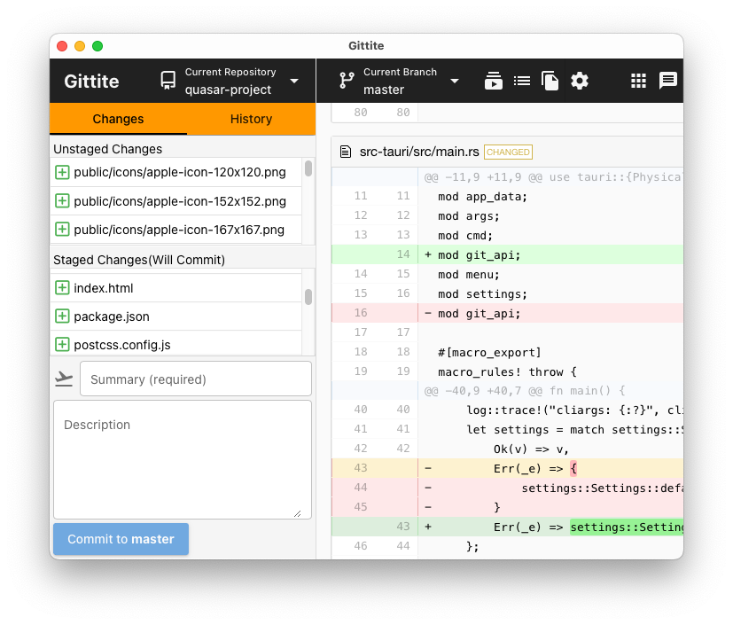

# Gittite

Git gui client based on tauri framework.

This is a toy project to study tauri and rust.

## Todo

- [x] implement simple git command with tauri
- [x] one git function i.e. log and changes
- [x] all git2 function
- [ ] test scheme and data
- [ ] js library and test
- [ ] frequently use case

## personal goal

- [x] rust, tauri
- [x] js framework i.e. vue, svelte, ...
- [x] git

## Commands

- `cargo tauri dev` : Start app in dev mode
- `cargo tauri build`: Build
- `cargo install --list`

## Log trace

- `export RUST_LOG=trace`
- `cargo test -- --nocapture`

## Reference

- tauri
- git2-rs
- gitui
- vue
- quasar
